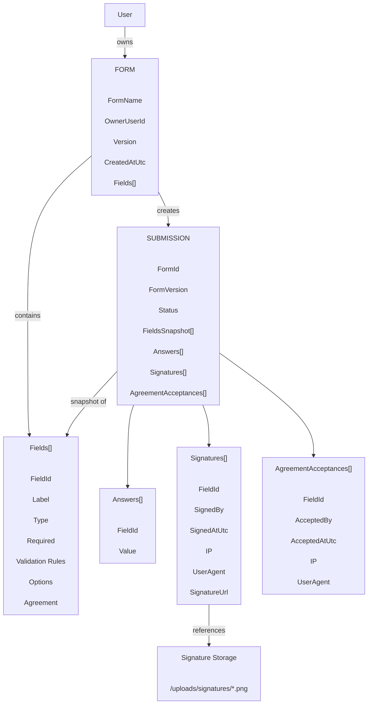

# 🚀 UseSignFlow - Backend

A modern backend application built with **C# .NET** and **MongoDB**.

This project provides a scalable and maintainable API architecture using .NET technologies and NoSQL database design principles.

---

## 🛠️ Technologies

- **C#**
- **.NET 8 / .NET 9**
- **ASP.NET Core Web API**
- **MongoDB**
- **MongoDB.Driver**
- **Entity Design Patterns**
- **Dependency Injection**
- **RESTful API Architecture**
- **Docker (Optional)**

---

## 📌 Features

✅ RESTful API endpoints  
✅ MongoDB document-based data storage  
✅ Clean architecture approach  
✅ Dependency Injection support  
✅ Async programming with async/await  
✅ DTO based data transfer  
✅ Validation support  
✅ Swagger API documentation  
✅ Environment based configuration  
✅ Scalable project structure  

---

## 📌 Form and Submission Diagram



---

# ⚙️ Installation

## 1. Clone Repository

```bash
git clone https://github.com/username/usesignflow-backend.git

```

# ⚙️ Install Dependencies

## 1. Restore NuGet packages:

```bash
dotnet restore

```

# ⚙️ MongoDB Configuration

## 1. Update your appsettings.json:

```bash
{
  "MongoDbSettings": {
    "ConnectionString": "mongodb://localhost:27017",
    "DatabaseName": "MyDatabase"
  }
}

```

# ⚙️ Run Application

## 1. Application will start:

```bash
[dotnet restore](https://localhost:5001)
```
```bash
dotnet run
